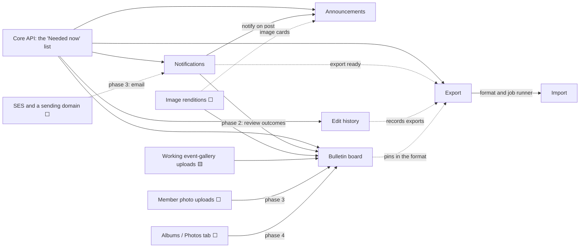

# Feature proposals

Design proposals for five features that aren't in the [endpoint reference](../../api/README.md) or the [baseline schema](../../database/migrations/schema/2026_09_29_baseline_up.sql) yet. **Proposed, 2026-09-30.** Nothing here is built or decided; the DDL in each proposal is a sketch, not a migration, and the routes are ⬜ **Proposed** in the reference's [legend](../../api/README.md#legend): 🟢 public, 🔴 Cognito JWT (identity only; the role is listed separately), 🔵 internal.

They build on the decisions already taken ([API decisions](../../api/README.md#decisions), [schema decisions](../../database/docs/schema-review.md#decisions)): one `images` table with uses as references, soft delete with a 30-day restore and an admin purge, one role per member, UTC storage, and announcements as they're specified.

| Proposal | In one line | Smallest first version | New tables |
| --- | --- | --- | --- |
| [Notifications](notifications.md) | In-app notifications with read/unread, email later. | Bell, list, mark read; `announcement.posted` only; no email. | `notifications` (later `notification_preferences`) |
| [Announcements: what's left](announcements.md) | The Announcements tab, and yes to one image and notifications, no to tags. | The tab and composer on the existing routes, plus notify on post. | None (phase 3 adds a column) |
| [Club bulletin board](bulletin-board.md) | Each club's shared collage, with member submissions, review, and a timeline. | An e-board-only board: pin existing photos, notes, and tickets; timeline and replay. | `board_pins` |
| [Edit history](edit-history.md) | Who created, edited, cancelled, deleted, or restored what. Recommends an append-only audit log over version tables. | The log written by every write handler; the club's History list. | `audit_log` |
| [Import and export](import-export.md) | A round-trip `.zip` (workbook + images), async jobs, dry-run imports. | Club export, data only. | `data_jobs` |

## Recommended order

**First, the "Needed now" list.** The `api/` module has no code yet, and the frontend is waiting on the work in [coverage.md](../../api/coverage.md#needed-now) (usable image URLs, creating and editing events, drafts, logos). Every proposal here needs its role checks and write handlers, so none should jump ahead of it.

Then, in this order:

1. **Notifications, phase 1 (in-app).** Small, needs no new infrastructure, and it's the piece announcements and the board both wait for.
2. **Announcements, phase 1.** The tables, queries, and contracts exist, so it's mostly frontend work. It's the first user of notifications, which proves `Notify` on a simple case before the board depends on it.
3. **Edit history, phase 1.** Not a screen feature so much as a convention: one insert in every write handler. It's cheapest to add while those handlers are first written for the "Needed now" list, so start its write helper alongside them, and ship the History screen here.
4. **Export, phase 1 (data only).** Independent, small, and useful at the spring e-board handover. It builds the async job runner that import reuses.
5. **Bulletin board, phases 1 and 2.** The largest feature and the one with the most missing pieces: renditions, working gallery uploads, then notifications for review. Phase 1 (e-board only) needs no notifications, so it can move earlier if the team wants the flagship design sooner; phase 2 needs notifications phase 1, which will exist by then.
6. **Import.** Last: it has to validate every entity, it's easiest once the export format has settled (board pins included), and it's rare and admin-run at first.

Later phases follow when they're wanted: email notifications (needs SES and a domain), announcement images, member photo uploads for the board, import's `create` mode, albums.

The numbers after each name are that proposal's own phases (import and export share one numbering).

| Wave | Work |
| --- | --- |
| 1 | Notifications 1 · Announcements 1 · Edit history 1 (write helper from the start) |
| 2 | Export 1 · Board 1 (with renditions) · Announcements 2 (single page, My Clubs feed, recently deleted) |
| 3 | Board 2 (submissions, review) · Export 2 (images) · Notifications 3 (email) |
| 4 | Import 3 (`restore`) · Board 3 (member uploads) · Announcements 3 (image) |
| Later | Import 4 (`create`, invitations) · Board 4 (albums, popular boards) · event reminders |

## How they depend on each other

Solid arrows are hard dependencies (can't ship without); dashed ones are soft (better with). ⬜ (not built) and 🟨 (broken) mark prerequisites that aren't one of the five proposals.

The same, as a table:

| Proposal | Needs (hard) | Better with (soft) |
| --- | --- | --- |
| Notifications | Core API | SES and a domain, for email (phase 3) |
| Announcements | Core API; notifications phase 1 for "a new post from your club" | Renditions, for its image (phase 3) |
| Bulletin board | Core API; renditions; working gallery uploads (phase 1); notifications (phase 2); member photo uploads (phase 3); albums (phase 4) | — |
| Edit history | Core API write handlers | — |
| Export | Core API | Notifications ("export ready"); edit history (records exports) |
| Import | Export's format and job runner | Invitations, for rosters in `create` mode |

## What doesn't exist yet

Gaps these proposals found, beyond the proposals themselves. The board's three named dependencies come first.

| Gap | Needed by | State today | Proposed handling |
| --- | --- | --- | --- |
| **Notifications** | Announcements, board phase 2, export | ⬜ | [Proposal 1](notifications.md). |
| **Member photo uploads** | Board phase 3 | ⬜ Every upload route is for managers, and none checks auth, type, or size today ([images.md](../../api/endpoints/images.md)). | Board phase 3, after the upload routes are protected. |
| **Albums** (a Photos tab) | Board phase 4 ("photos straight from their albums") | ⬜ Not designed. Event galleries are the only photo collections. | `GET /clubs/{clubId}/photos` over flyers and galleries stands in. |
| Working event-gallery uploads | Board phase 1 | 🟨 The confirm fails on warm Lambdas and the list route is broken; the protected routes are Later. | Part of the core API's image work. |
| Image renditions | Board phase 1; also galleries and announcement images | ⬜ Every read would serve the 2–4 MB original. | An S3-triggered resize Lambda writing a 640-pixel copy beside each upload ([board](bulletin-board.md#images-and-storage)). |
| Student display names | The board's review queue, history, notifications | `student_info` exists; nothing writes it. | Emails for the e-board (decision 6), "A member" elsewhere, as the board design already does. |
| A network path out of the VPC | Email (SES), async jobs | The legacy VPC has no NAT: Lambdas reach only Secrets Manager (interface endpoint) and S3 (gateway endpoint). | Jobs trigger through S3 events (free); email through one SES SMTP endpoint (~$7.30 a month). |
| SES production access and a sending domain | Email notifications | ⬜ | [Notifications phase 3](notifications.md#email-delivery-phase-3). |
| Description length caps | Export round trip (Excel holds 32,767 characters per cell) | `TEXT` columns with no API limit. | 10,000 for events, 5,000 for clubs and announcement bodies. |
| Consent between clubs | Announcement notifications to associate clubs; event co-hosts | Any e-board can list any club as an associate. | Notify only clubs the author manages ([announcements](announcements.md#notifications)). |
| RDS backup retention | "Exports aren't backups" | One day in the legacy stack. | Raise it when the new infrastructure is written. |

## Changes to existing things, all proposals together

No existing column is removed or changed. The one new column on an existing table is `announcements.fk_thumbnail_id` (announcements phase 3).

| Existing | Changed by | Change |
| --- | --- | --- |
| [`UPDATE_image_soft_delete_if_unused.sql`](../../database/queries/images/release/UPDATE_image_soft_delete_if_unused.sql), [`SELECT_purgeable_images.sql`](../../database/queries/images/purge/SELECT_purgeable_images.sql) | Board; announcements phase 3 | One more `NOT EXISTS` per new kind of use (pins, announcement images). |
| [`UPDATE_images_of_purgeable_events.sql`](../../database/queries/events/purge/UPDATE_images_of_purgeable_events.sql) | Board | Keeps a purged event's photo if a pin uses it. |
| [`DELETE /images/{imageId}`](../../api/endpoints/images.md#-delete-imagesimageid) (takedown) | Board; announcements phase 3 | Also removes pins and clears announcement images. |
| [`POST /admins/purge`](../../api/endpoints/admins.md#-post-adminspurge) | Board; announcements phase 3; edit history; notifications | Purges removed and declined pins (tickets go with their events by cascade) and announcement images; replaces purged entities' history with a `purged` row; old notifications (proposed). |
| Announcement create and `PATCH` | Announcements; notifications; edit history | Notify on posting; an audit row; the 5,000-character body limit. |
| Every club, event, and announcement write | Edit history | One audit row in the same transaction. |
| Event and club create and `PATCH` validation | Import and export | Description length caps. |
| `announcement_details` view | Announcements phase 3 | The image's key and alt text. |
| `images.purpose` values | Board phase 3; announcements phase 3 | `board-photo`, `announcement-thumbnail`. |

**How the sketches were checked.** Every `CREATE TABLE` and `ALTER TABLE` sketch was applied, in dependency order, to a throwaway MySQL 8.0.46 (the version the [schema review](../../database/docs/schema-review.md#how-it-was-tested) used) after the baseline and seed, and then dropped; nothing under `database/` changed. The constraints the proposals rely on were exercised: each of `board_pins`' `CHECK`s and its stack-order key, a pinned image refusing deletion, a purged event taking its ticket with it, notification grouping (a second unread row bumps the first; a read one doesn't block a new one), the unread count as an index-only read, `audit_log`'s multi-valued index serving `MEMBER OF`, and `data_jobs` allowing one active export per club and one active import per requester. MySQL refused `SET NULL` and `ON UPDATE CASCADE` on a column a `CHECK` uses (error 3823), which [the board's](bulletin-board.md#ddl-sketch) foreign keys account for.

When a proposal is accepted, its tables go into the baseline while there's still no live database (as the announcement tables did), or into a dated migration after one exists; its routes go into [`api/endpoints/`](../../api/endpoints/), its queries into [`database/queries/`](../../database/queries/), and [`schema.dbml`](../../database/docs/schema.dbml) and [coverage.md](../../api/coverage.md) are updated with them.

## Scale and price assumptions

Every cost in these proposals uses the same numbers. There's no live system to measure, so these are assumptions about Hunter, to be replaced with real numbers once the platform runs.

| Quantity | Assumed |
| --- | --- |
| Clubs on the platform | 200 |
| Clubs active in a given week | 50 |
| Students with accounts | 5,000 |
| Students active on a typical day | 1,000 |
| Members per club | 60 on average; 500 in the largest |
| Per active club, per semester | 15 events, 15 announcements, ~300 photos at ~2.5 MB |
| Board views | ~3,000 a month |

Prices are **us-east-1 list prices as the author knows them, not quoted from AWS**: nothing in this work called AWS. Check the [AWS Pricing Calculator](https://calculator.aws/) before budgeting.

| Service | Price used |
| --- | --- |
| API Gateway HTTP API | $1.00 per million requests |
| Lambda | $0.20 per million requests + $0.0000166667 per GB-second; always-free tier of 1M requests and 400,000 GB-seconds a month |
| S3 Standard | $0.023 per GB-month; PUT $0.005 and GET $0.0004 per 1,000 requests |
| Data transfer out to the internet | First 100 GB a month free across the account, then $0.09 per GB |
| SES | $0.10 per 1,000 emails |
| Interface VPC endpoint | $0.01 per AZ-hour (~$7.30 a month in one AZ) + $0.01 per GB |
| NAT gateway (for comparison) | $0.045 per hour (~$32.85 a month) + $0.045 per GB |
| RDS gp2 storage | $0.115 per GB-month; the instance itself is already paid for |
| EventBridge Scheduler | 14 million invocations a month free |

**Totals:** everything in-app (notifications phase 1, announcements, the board with renditions, edit history) comes to **under $2 a month**. Email notifications add **about $9 a month**, most of it the SES endpoint. Exports cost **a few dollars a semester**, almost all download bandwidth.

## Decisions needed to start

The open questions that block a first version. Each proposal lists the rest.

1. **Notifications:** in-app first, email later: agreed? ([open questions](notifications.md#open-questions))
2. **Announcements:** plain-text bodies, and notifying only clubs the author manages? ([open questions](announcements.md#open-questions))
3. **Board:** public or members-only reading, and a required decline note? ([open questions](bulletin-board.md#open-questions))
4. **Edit history:** the audit log over version tables? ([comparison](edit-history.md#comparison))
5. **Export:** member emails opt-in, and the policy check with Student Activities on rosters leaving the platform? ([privacy](import-export.md#privacy))
